  

 

 

  

 

## 🧰 &nbsp;Stack

  

 

  

 

## 🎯 &nbsp;Focus

Infrastructure engineer designing and operating the Kubernetes, CI/CD, and observability stacks behind production systems — from self-managed K3s clusters and service meshes to zero-trust, keyless CI/CD pipelines running in AWS.

 

Currently building out service mesh + GitOps delivery on a self-managed K3s cluster, and running production CI/CD for a MERN e-commerce platform on self-hosted Jenkins.

 

## 📁 &nbsp;Case studies

Each project below is infrastructure I designed, deployed, and operate — written as a case study because the decisions matter more than the tech list.

 

<table>
<tr>
<td width="50%" valign="top">
